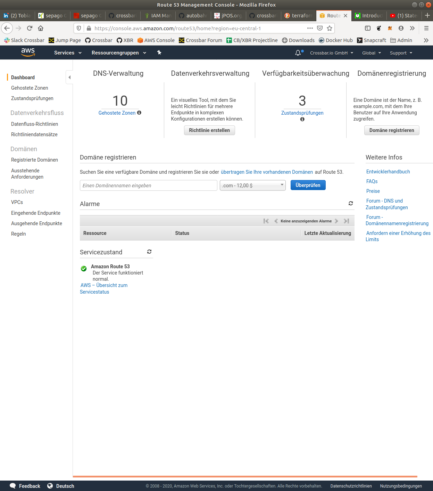

# Crossbar.io FX Cloud

[](https://registry.terraform.io/modules/crossbario/crossbar)

This project provides a [Terraform module](https://www.terraform.io/docs/configuration/modules.html) that can create Crossbar.io FX based clusters and cloud deployments in AWS.
The module is [open-source](LICENSE), based on the [Terraform Provider for AWS](https://terraform.io/docs/providers/aws/index.html) and
[published](https://registry.terraform.io/modules/crossbario/crossbarfx)
to the [Terraform Registry](https://registry.terraform.io/).

## Introduction

Crossbar.io FX Cloud is a complete cloud setup with a Crossbar.io FX cluster which provides:

* clustered WAMP application routing
* remote cluster management and monitoring
* static Web content hosting and other Web services
* optional HTTP/REST-to-WAMP and MQTT-to-WAMP bridges
* optional XBR data market

Crossbar.io FX Cloud uses Terraform to automate the deployment of all cloud resources required for
an auto-scaling enabled Crossbar.io FX cluster in AWS:

* an AWS VPC spanning three AZs with three Subnets (one in each AZ)
* an AWS NLB (Network Load Balancer), spanning all AZs
* an AWS Route 53 Zone (DNS) pointing to the NLB
* AWS EFS shared filesystems, spanning all AZs
* an AWS EC2 instance for the CrossbarFX master node
* an AWS Auto-scaling group of AWS EC2 instances for the CrossbarFX edge/core nodes

The cluster auto-scaling group will have an initial size of two, which together with the master node results in a **total of three AWS EC2 instances started** by default. The edge/core nodes will be automatically paired with the (default) management realm.

## How to use

The following describes how to create a new *Crossbar.io FX Cloud* to host a domain (or subdomain) you control.

1. Prerequisites
2. Create AWS Zone
3. Configure DNS Domain
4. Initialize repository
5. Import AWS Zone
6. Deploy cloud setup

### Prerequisites

You will need the following to create a *Crossbar.io FX Cloud*:

1. GitHub account
1. AWS account
1. own DNS domain
1. Terraform CLI

**DNS Domain**

You will need a DNS domain (or subdomain) under your control for your *Terraform for Crossbar.io FX*
cloud. "Control" here means that you must be able to configure the authorative DNS nameservers
for your domain, usually using a user interface provided by your DNS registrar.

> Note: you MUST be able to configure DNS NS entries for nameservers in your domain. The entries
will need to point to AWS nameservers specific to the AWS Route 53 zone you create.

**AWS Account**

You can use your personal AWS account for running Terraform, but using an IAM user specifically
created for Terraform automation access is preferred for production.

An IAM user for Terraform with quite broad permissions to get you started easily in development
should have the following permissions:

* AmazonEC2FullAccess
* AutoScalingFullAccess
* ElasticLoadBalancingFullAccess
* AmazonS3FullAccess
* CloudFrontFullAccess
* AmazonVPCFullAccess
* AmazonElasticFileSystemFullAccess
* AmazonSNSFullAccess
* AmazonRoute53FullAccess
* AWSCertificateManagerFullAccess

This will allow Terraform to create and manage AWS cloud resources required for *Crossbar.io FX Cloud*.

**Terraform**

For Terraform, you can use either the [Terraform command-line tool (CLI)](https://www.terraform.io/downloads.html)
or use your account on [Terraform cloud](https://app.terraform.io/).

When using the Terraform CLI

```console
$ which terraform
/usr/local/bin/terraform
$ terraform --version
Terraform v0.12.28
```

the actual AWS resources currently running and (local) desired Terraform configuration (and local state files) are compared,
and necessary actions on AWS are taken by calling into the AWS API using the IAM user configured locally.

The IAM user can be set via environment variables

```console
export AWS_ACCESS_KEY_ID="AKIA..."
export AWS_SECRET_ACCESS_KEY="yXbT..."
export AWS_DEFAULT_REGION="eu-central-1"
```

or configuration

```console
$ cat ~/.aws/credentials
[default]
aws_access_key_id = AKIA...
aws_secret_access_key = yXbT...
aws_default_region = eu-central-1
```

See [here](https://www.terraform.io/docs/providers/aws/index.html) for further information.

When using Terraform cloud, the desired Terraform configuration must be versioned in a GitHub repository, and state is
stored in Terraform cloud. In this case, the AWS IAM user to be used must be configured in Terraform cloud.


### Create AWS Zone

Before you can start automated deployment of your new Crossbar.io FX Cloud, you need to create a *hosted zone*
in AWS Route53 and configure your domain to use the AWS nameservers specific to the zone.

In your web browser, sign in to the AWS Management Console.

From the Services menu, navigate to Route 53. In the Route 53 dashboard, switch to the view of your Hosted Zones.



Add a new hosted zone for the domain name you want to configure:


And note the Zone ID and AWS DNS nameservers (the four IP addresses in the NS record of the zone):


### Configure DNS Domain

Register the AWS name servers for your Route 53 zone with the registrar of your domain name.

When a new Hosted Zone is created, Route 53 automatically generates the obligatory SOA entry as well as an NS record with four name servers supplied by AWS, e.g.


```
ns-122.awsdns-15.com
ns-926.awsdns-51.net
ns-2043.awsdns-63.co.uk
ns-1040.awsdns-02.org
```

Make sure that these four name servers are registered as authoritative name servers for your domain with the registrar of your domain (this is the company whose service you used to register your domain name).


After configuration, the new nameservers need to propagate the DNS system.
Once that has happened (which may take several minutes to half an hour), resolving your domain should return all four AWS nameservers for your zone.

To [test nameservers using dig](https://support.rackspace.com/how-to/using-dig-to-query-nameservers/):

```console
dig @8.8.8.8 +short NS yourdomain.xyz
```

**IMPORTANT: You must wait before continuing until you can verify the correct nameservers. This can take several minutes or even an hour or longer after you modified nameservers at your registrar for DNS to replicate.**

### Initialize repository

Create and clone a new GitHub repository for your cloud. Now create a single file **main.tf** with this contents:

```terraform
module "crossbar" {
    source  = "crossbario/crossbar/aws"
    version = "1.5.1"

    aws-region = "eu-central-1"
    admin-pubkey = "ssh-key.pub"

    dns-domain-name = "yourdomain.xyz"

    domain-web-bucket = "yourdomain.xyz-web"
    domain-weblog-bucket = "yourdomain.xyz-weblog"
    domain-download-bucket = "yourdomain.xyz-download"
    domain-backup-bucket = "yourdomain.xyz-backup"
}
```

Initialize Terraform:

```console
terraform init
```

### Import AWS Zone

Now import the AWS zone **YOURDOMAIN-XYZ-ZONE-ID** you previously created (manually):

```console
terraform import module.crossbar.aws_route53_zone.crossbar-zone YOURDOMAIN-XYZ-ZONE-ID
```

### Deploy cloud setup

Finally, to automatically deploy and configure everything in AWS:

```console
terraform plan
terraform apply
```

#### Deploy a cluster from Terraform Cloud

If you have an account at [Terraform Cloud](https://app.terraform.io), you can also
(as an alternative to the pure CLI approach described above) create a new workspace
and deploy from there:


#### Use the CLI together with Terraform Cloud

To access and use the state stored remotely in your Terraform Cloud workspace,
and the following to `main.tf`, adjusting for your **organization** and **workspace**:

```console
terraform {
  backend "remote" {
    hostname = "app.terraform.io"
    organization = "crossbario"
    workspaces {
      name = "xbr-network"
    }
  }
}
```

## Packer

The Terraform based setup on AWS is based on AMIs which come with Docker and Crossbar.io FX preinstalled.

We use [HashiCorp Packer](https://www.packer.io/) to bake AMI images directly from our Crossbar.io FX Docker images.

The AMI is build according to the packaging file [crossbarfx-ami.json](crossbarfx-ami.json). To rebuild and
publish AMI images after a new Crossbar.io FX Docker image has been published, run:

```console
make build
```

Note the AMI ID printed, and update [root/variables.tf](root/variables.tf) accordingly, eg

* CrossbarFX 20.6.2: **ami-06ca2353bcdf3ac29**

Here is the log for above:

```console
oberstet@intel-nuci7:~/scm/crossbario/crossbario-devops/terraform$ make build
...
==> amazon-ebs: Digest: sha256:32b6329873e0a755121e18f7757874de24d4a557108cf4d1b36903a7cae669ad
==> amazon-ebs: Status: Downloaded newer image for crossbario/crossbarfx:pypy-slim-amd64
    amazon-ebs:
    amazon-ebs:     :::::::::::::::::
    amazon-ebs:           :::::          _____                 __              _____  __
    amazon-ebs:     :::::   :   :::::   / ___/______  ___ ___ / /  ___ _____  / __/ |/_/
    amazon-ebs:     :::::::   :::::::  / /__/ __/ _ \(_-<(_-</ _ \/ _ `/ __/ / _/_>  <
    amazon-ebs:     :::::   :   :::::  \___/_/  \___/___/___/_.__/\_,_/_/   /_/ /_/|_|
    amazon-ebs:           :::::
    amazon-ebs:     :::::::::::::::::   Crossbar.io FX v20.6.2 [00000]
    amazon-ebs:
    amazon-ebs:     Copyright (c) 2013-2020 Crossbar.io Technologies GmbH. All rights reserved.
    amazon-ebs:
    amazon-ebs:  Crossbar.io        : 20.6.2
    amazon-ebs:    txaio            : 20.4.1
    amazon-ebs:    Autobahn         : 20.6.2
    amazon-ebs:      UTF8 Validator : autobahn
    amazon-ebs:      XOR Masker     : autobahn
    amazon-ebs:      JSON Codec     : stdlib
    amazon-ebs:      MsgPack Codec  : umsgpack-2.6.0
    amazon-ebs:      CBOR Codec     : cbor-1.0.0
    amazon-ebs:      UBJSON Codec   : ubjson-0.16.1
    amazon-ebs:      FlatBuffers    : flatbuffers-1.12
    amazon-ebs:    Twisted          : 20.3.0-EPollReactor
    amazon-ebs:    LMDB             : 0.98/lmdb-0.9.22
    amazon-ebs:    Python           : 3.6.9/PyPy-7.3.0
    amazon-ebs:  CrossbarFX         : 20.6.2
    amazon-ebs:    NumPy            : 1.15.4
    amazon-ebs:    zLMDB            : 20.4.1
    amazon-ebs:  Frozen executable  : no
    amazon-ebs:  Operating system   : Linux-5.3.0-1023-aws-x86_64-with-debian-9.11
    amazon-ebs:  Host machine       : x86_64
    amazon-ebs:  Release key        : RWQHer9KKmNsqP057xopw37DfYE8pl92aOWU5E+OWdhlwtCns7nlKjpE
    amazon-ebs:
==> amazon-ebs: Stopping the source instance...
    amazon-ebs: Stopping instance
==> amazon-ebs: Waiting for the instance to stop...
==> amazon-ebs: Creating AMI crossbarfx-ami-1593617540 from instance i-05911e29903bfff0a
    amazon-ebs: AMI: ami-06ca2353bcdf3ac29
==> amazon-ebs: Waiting for AMI to become ready...
==> amazon-ebs: Terminating the source AWS instance...
==> amazon-ebs: Cleaning up any extra volumes...
==> amazon-ebs: No volumes to clean up, skipping
==> amazon-ebs: Deleting temporary security group...
==> amazon-ebs: Deleting temporary keypair...
Build 'amazon-ebs' finished.

==> Builds finished. The artifacts of successful builds are:
--> amazon-ebs: AMIs were created:
eu-central-1: ami-06ca2353bcdf3ac29

(cpy382_1) oberstet@intel-nuci7:~/scm/crossbario/crossbario-devops/terraform$
```

