# Terraform based setup of Crossbar.io FX

[](https://registry.terraform.io/modules/crossbario/crossbarfx)

*FIXMEs to make below work completely:*

* [ ] https://github.com/crossbario/crossbarfx/issues/565
* [ ] https://github.com/crossbario/crossbarfx/issues/564

-----

This project provides a [Terraform module](https://www.terraform.io/docs/configuration/modules.html) that can create clusters of Crossbar.io FX nodes in AWS.
The module is [open-source](LICENSE), based on the [Terraform Provider for AWS](https://terraform.io/docs/providers/aws/index.html) and
[published](https://registry.terraform.io/modules/crossbario/crossbarfx)
to the [Terraform Registry](https://registry.terraform.io/).

The module will define all cloud resources required for an auto-scaling enabled
Crossbar.io FX cluster in AWS:

* one AWS VPC spanning three AZs with three Subnets (one in each AZ)
* one AWS NLB (Network Load Balancer), spanning all AZs
* one AWS Route 53 Zone (DNS) pointing to the NLB
* one AWS EFS shared filesystem, spanning all AZs
* one AWS EC2 instance for the CrossbarFX master node
* one AWS Auto-scaling group of AWS EC2 instances for the CrossbarFX edge/core nodes

The cluster auto-scaling group will have an initial size of two, which together with the master node results in a total of three AWS EC2 instances started. The edge/core nodes will be automatically paired with the defaut management realm.

## Usage

### Prerequisites

You will need an AWS account to create a cluster.

Next, you can use either the [Terraform command-line tool](https://www.terraform.io/downloads.html)

```console
oberstet@intel-nuci7:~$ which terraform
/usr/local/bin/terraform
oberstet@intel-nuci7:~$ terraform --version
Terraform v0.12.28
```

or use your account on [Terraform cloud](https://app.terraform.io/):

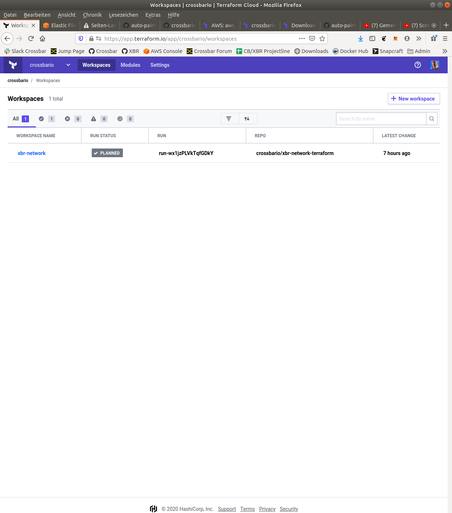

You can use your personal AWS account for running Terraform CLI or for use from
the Terraform Cloud, but using an IAM user specifically used for Terraform automation access is preferred. Here is an example user for Terraform with
quite broad permissions to get you started easily:

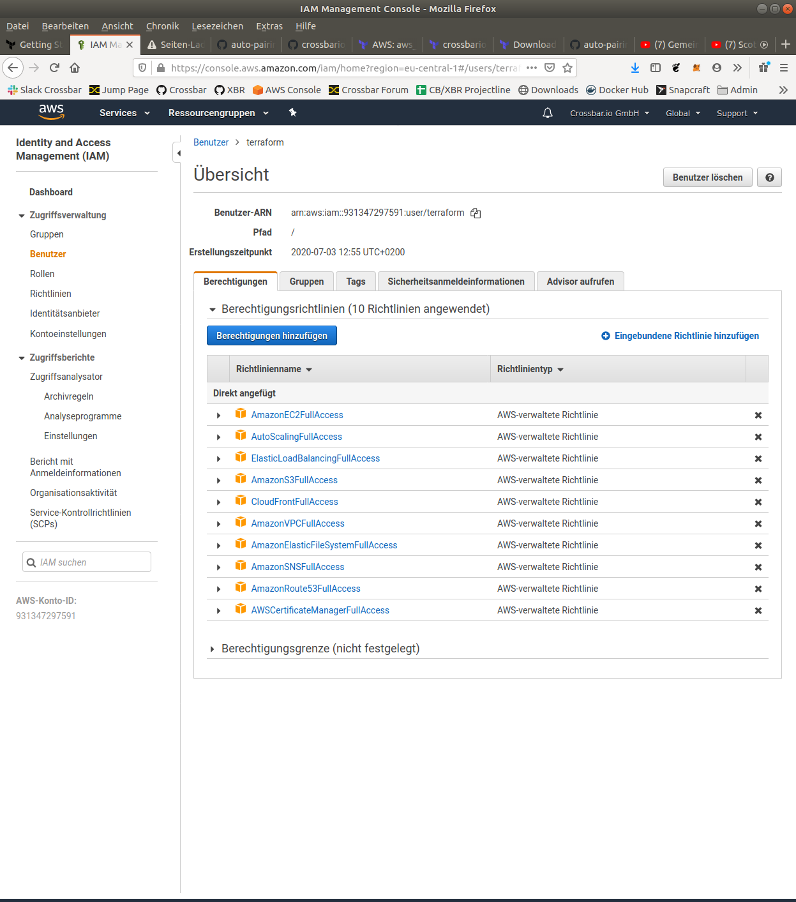


### Deploy a cluster from CLI

The following will create and deploy a Crossbar.io FX based cluster in AWS with two edge nodes and one master node.

First, create a new Terraform workspace and a file `main.tf`

```console
mkdir ~/myenv1
cd ~/myenv1
main.tf
```

with this contents (adjust `DOMAIN_NAME` and `DOMAIN_ID` at least):

```hcl
module "crossbarfx" {
    # module for crossbarfx clusters
    source  = "crossbario/crossbarfx/aws"
    version = "1.1.2"

    # your SSH public key
    PUBKEY = "~/.ssh/id_rsa.pub"

    # which AWS region and availability zones (within that region) to deploy to
    AWS_REGION = "eu-central-1"
    AWS_AZ = ["eu-central-1a", "eu-central-1b", "eu-central-1c"]

    # what instance type to use (for both master and edge nodes)
    INSTANCE_TYPE = "t3a.medium"

    # for which DNS domain name and ID to host
    DOMAIN_NAME = "example.com"
    DOMAIN_ID = "example-com"

    # setup TLS certificates and all that (note: this can only be activated
    # once the domain nameservers do work)
    ENABLE_TLS = false
}
```

Now initialize your workspace

```console
terraform init
```

and plan and apply your deployment

```console
terraform plan
terraform apply
```

### Deploy a cluster from Terraform Cloud

If you have an account at [Terraform Cloud](https://app.terraform.io), you can also
(as an alternative to the pure CLI approach described above) create a new workspace
and deploy from there:

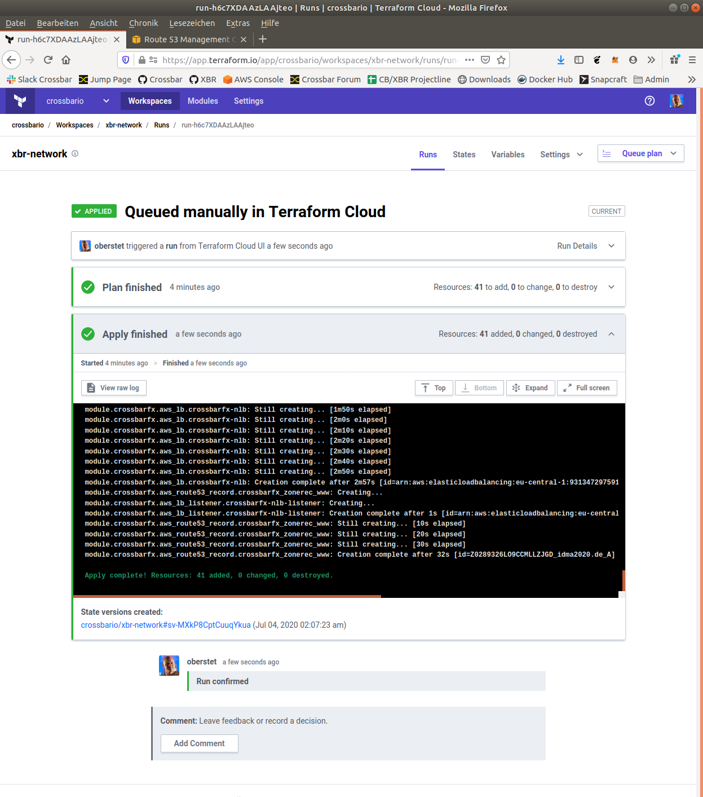

```console
terraform {
  backend "remote" {
    hostname = "app.terraform.io"
    organization = "crossbario"
    workspaces {
      name = "xbr-network"
    }
  }
}
```


```console
oberstet@intel-nuci7:~/scm/crossbario/xbr-network-terraform$ terraform login
Terraform will request an API token for app.terraform.io using your browser.

If login is successful, Terraform will store the token in plain text in
the following file for use by subsequent commands:
    /home/oberstet/.terraform.d/credentials.tfrc.json

Do you want to proceed? (y/n) y
Terraform must now open a web browser to the tokens page for app.terraform.io.

If a browser does not open this automatically, open the following URL to proceed:
    https://app.terraform.io/app/settings/tokens?source=terraform-login


---------------------------------------------------------------------------------

Generate a token using your browser, and copy-paste it into this prompt.

Terraform will store the token in plain text in the following file
for use by subsequent commands:
    /home/oberstet/.terraform.d/credentials.tfrc.json

Token for app.terraform.io:

Retrieved token for user oberstet


---------------------------------------------------------------------------------

Success! Terraform has obtained and saved an API token.

The new API token will be used for any future Terraform command that must make
authenticated requests to app.terraform.io.
```

```console
oberstet@intel-nuci7:~/scm/crossbario/xbr-network-terraform$ terraform init
Initializing modules...

Initializing the backend...

Successfully configured the backend "remote"! Terraform will automatically
use this backend unless the backend configuration changes.

Initializing provider plugins...
- Checking for available provider plugins...
- Downloading plugin for provider "aws" (hashicorp/aws) 2.69.0...

The following providers do not have any version constraints in configuration,
so the latest version was installed.

To prevent automatic upgrades to new major versions that may contain breaking
changes, it is recommended to add version = "..." constraints to the
corresponding provider blocks in configuration, with the constraint strings
suggested below.

* provider.aws: version = "~> 2.69"

Terraform has been successfully initialized!

You may now begin working with Terraform. Try running "terraform plan" to see
any changes that are required for your infrastructure. All Terraform commands
should now work.

If you ever set or change modules or backend configuration for Terraform,
rerun this command to reinitialize your working directory. If you forget, other
commands will detect it and remind you to do so if necessary.
```


```console
oberstet@intel-nuci7:~/scm/crossbario/xbr-network-terraform$ terraform plan
Running plan in the remote backend. Output will stream here. Pressing Ctrl-C
will stop streaming the logs, but will not stop the plan running remotely.

Preparing the remote plan...

To view this run in a browser, visit:
https://app.terraform.io/app/crossbario/xbr-network/runs/run-zkjoQ7Xv3ToS9UYY

Waiting for the plan to start...

Terraform v0.12.28
Configuring remote state backend...
Initializing Terraform configuration...
2020/07/03 21:30:34 [DEBUG] Using modified User-Agent: Terraform/0.12.28 TFC/c371e125d8
Refreshing Terraform state in-memory prior to plan...
The refreshed state will be used to calculate this plan, but will not be
persisted to local or remote state storage.

module.crossbarfx.aws_key_pair.crossbarfx_keypair: Refreshing state... [id=crossbarfx_keypair]
module.crossbarfx.aws_vpc.crossbarfx_vpc: Refreshing state... [id=vpc-01dc6d7efb72161b8]
module.crossbarfx.aws_route53_zone.crossbarfx_zone: Refreshing state... [id=Z03853332AM0PBLP8NHVF]
module.crossbarfx.aws_efs_file_system.crossbarfx_efs: Refreshing state... [id=fs-5c941d04]
module.crossbarfx.aws_route53_record.crossbarfx_zonerec_ns: Refreshing state... [id=Z03853332AM0PBLP8NHVF_idma2020.de_NS]
module.crossbarfx.aws_efs_access_point.crossbarfx_efs_nodes: Refreshing state... [id=fsap-0aa886a62f7b1e973]
module.crossbarfx.aws_efs_access_point.crossbarfx_efs_master: Refreshing state... [id=fsap-029ce0a5020a08932]
module.crossbarfx.aws_subnet.crossbarfx_vpc_router2: Refreshing state... [id=subnet-08332a4f25cfd1d4b]
module.crossbarfx.aws_subnet.crossbarfx_vpc_router3: Refreshing state... [id=subnet-04fb2b804ba071f34]
module.crossbarfx.aws_internet_gateway.crossbarfx_vpc_gw: Refreshing state... [id=igw-06ade0b83f99d99b9]
module.crossbarfx.aws_subnet.crossbarfx_vpc_public3: Refreshing state... [id=subnet-0b194c86c197e1f91]
module.crossbarfx.aws_security_group.crossbarfx_master_node: Refreshing state... [id=sg-096be0c32e6dd4269]
module.crossbarfx.aws_lb_target_group.crossbarfx-nlb-target-group: Refreshing state... [id=arn:aws:elasticloadbalancing:eu-central-1:931347297591:targetgroup/crossbarfx-nlb-target-group/b79d1ddfa496f31e]
module.crossbarfx.aws_subnet.crossbarfx_vpc_router1: Refreshing state... [id=subnet-03ab579cd82dffa48]
module.crossbarfx.aws_subnet.crossbarfx_vpc_efs3: Refreshing state... [id=subnet-0e3abdd5a8332b5e7]
module.crossbarfx.aws_subnet.crossbarfx_vpc_public2: Refreshing state... [id=subnet-0df08c7cfea631439]
module.crossbarfx.aws_security_group.crossbarfx_elb: Refreshing state... [id=sg-035e804c1431003ff]
module.crossbarfx.aws_subnet.crossbarfx_vpc_public1: Refreshing state... [id=subnet-0633d70b3b2791793]
module.crossbarfx.aws_subnet.crossbarfx_vpc_efs1: Refreshing state... [id=subnet-09a9aa4d86b0154b4]
module.crossbarfx.aws_subnet.crossbarfx_vpc_efs2: Refreshing state... [id=subnet-06884fad07ee4eda4]
module.crossbarfx.aws_subnet.crossbarfx_vpc_master: Refreshing state... [id=subnet-07c402db2361e650d]
module.crossbarfx.aws_security_group.crossbarfx_efs: Refreshing state... [id=sg-059620515fad2f4c4]
module.crossbarfx.aws_security_group.crossbarfx_cluster_node: Refreshing state... [id=sg-03cec78cb272bbdcc]
module.crossbarfx.aws_route_table.crossbarfx_vpc_public: Refreshing state... [id=rtb-0f218b1098a787bc0]
module.crossbarfx.aws_lb.crossbarfx-nlb: Refreshing state... [id=arn:aws:elasticloadbalancing:eu-central-1:931347297591:loadbalancer/net/crossbarfx-nlb/a44b07cacfd50a80]
module.crossbarfx.aws_instance.crossbarfx_node_master: Refreshing state... [id=i-0a77bc10f2f3c9d0f]
module.crossbarfx.aws_route_table_association.crossbarfx_vpc-public-1-a: Refreshing state... [id=rtbassoc-022c34c8159afdf15]
module.crossbarfx.aws_route_table_association.crossbarfx_vpc-public-3-a: Refreshing state... [id=rtbassoc-002991c9af34ab382]
module.crossbarfx.aws_efs_mount_target.crossbarfx_efs_mt2: Refreshing state... [id=fsmt-3b125c62]
module.crossbarfx.aws_efs_mount_target.crossbarfx_efs_mt3: Refreshing state... [id=fsmt-38125c61]
module.crossbarfx.aws_route_table_association.crossbarfx_vpc-public-2-a: Refreshing state... [id=rtbassoc-0ebb285e21fc06a19]
module.crossbarfx.aws_efs_mount_target.crossbarfx_efs_mt1: Refreshing state... [id=fsmt-3d125c64]
module.crossbarfx.aws_route_table_association.crossbarfx_vpc_master: Refreshing state... [id=rtbassoc-07fbee20f1a9474f1]
module.crossbarfx.aws_route53_record.crossbarfx_zonerec_www: Refreshing state... [id=Z03853332AM0PBLP8NHVF_idma2020.de_A]
module.crossbarfx.aws_lb_listener.crossbarfx-nlb-listener: Refreshing state... [id=arn:aws:elasticloadbalancing:eu-central-1:931347297591:listener/net/crossbarfx-nlb/a44b07cacfd50a80/1806aa2a6ae7643e]
module.crossbarfx.aws_launch_configuration.crossbarfx_cluster_launchconfig: Refreshing state... [id=crossbarfx_cluster_launchconfig20200703133811629300000001]
module.crossbarfx.aws_autoscaling_group.crossbarfx_cluster_autoscaling: Refreshing state... [id=crossbarfx_cluster_autoscaling]
module.crossbarfx.aws_autoscaling_policy.crossbarfx_cluster_cpu_policy: Refreshing state... [id=crossbarfx_cluster_cpu_policy]
module.crossbarfx.aws_autoscaling_policy.crossbarfx_cluster_cpu_policy_scaledown: Refreshing state... [id=crossbarfx_cluster_cpu_olicy_scaledown]
module.crossbarfx.aws_cloudwatch_metric_alarm.crossbarfx_cluster_cpu_alarm_scaledown: Refreshing state... [id=crossbarfx_cluster_cpu_alarm_scaledown]
module.crossbarfx.aws_cloudwatch_metric_alarm.crossbarfx_cluster_cpu_alarm: Refreshing state... [id=crossbarfx_cluster_cpu-alarm]

------------------------------------------------------------------------

No changes. Infrastructure is up-to-date.

This means that Terraform did not detect any differences between your
configuration and real physical resources that exist. As a result, no
actions need to be performed.
oberstet@intel-nuci7:~/scm/crossbario/xbr-network-terraform$
```

### Configure your cluster

After you deployed your cluster, three nodes will be running

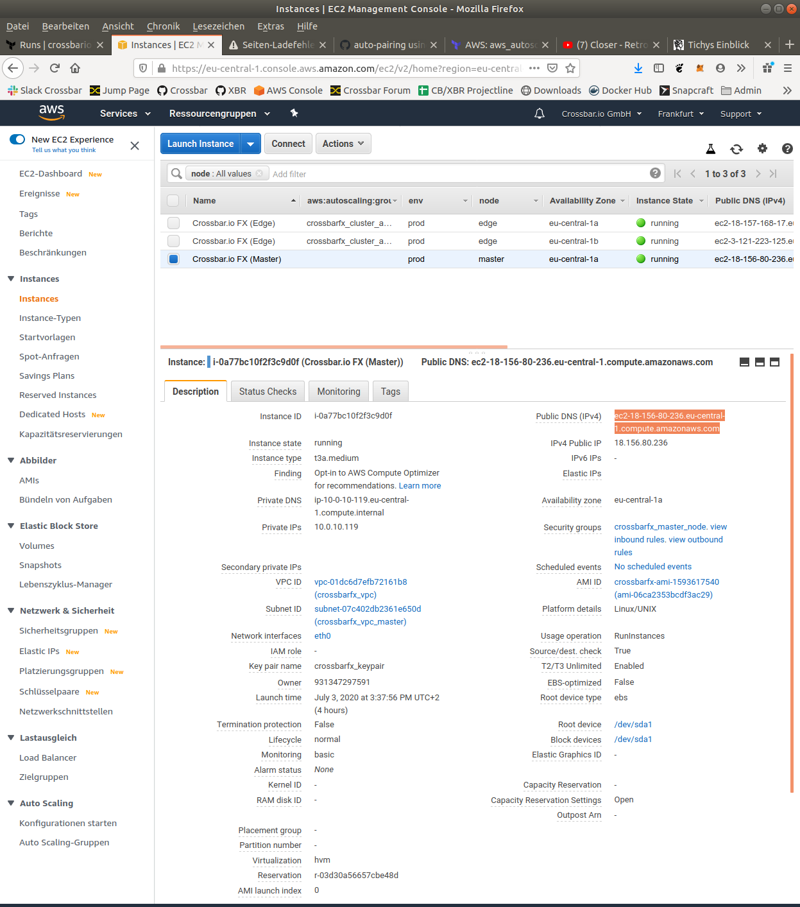

Login to the master node that was created:

```console
ssh ubuntu@ec2-18-156-80-236.eu-central-1.compute.amazonaws.com
```

Check the running master node service

```console
docker ps
systemctl status crossbarfx
journalctl -n200 -u crossbarfx
```

Test access to the master node running:

```console
crossbarfx shell auth
crossbarfx shell show status
```

Create a management realm:

```console
crossbarfx shell create mrealm mrealm1
crossbarfx shell list mrealms
crossbarfx shell show mrealm mrealm1
```

Pair a node:

```console
crossbarfx shell pair node f084... mrealm1 node1
crossbarfx shell --realm mrealm1 list nodes
crossbarfx shell --realm mrealm1 show node1
```


### Configuring DNS

In this example, we setup everything to have our new cluster host WAMP application routing, Web services and optionally XBR data market services for our domain

* **tentil.es**

We start by opening the AWS Route 53 console, creating a new AWS **zone** to be
used with our domain:

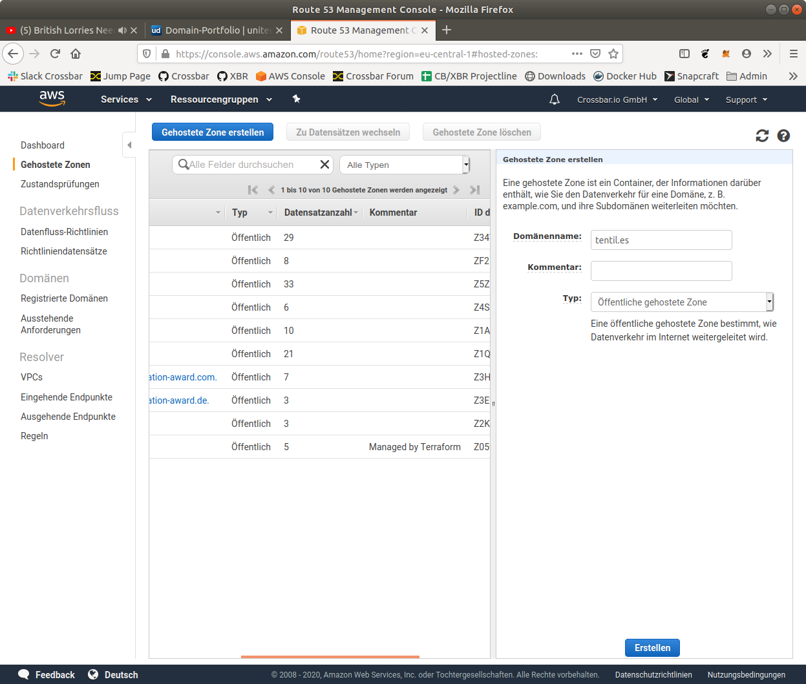

A new zone with Zone ID **Z07225043POQ86QQZSHMF** was created here.

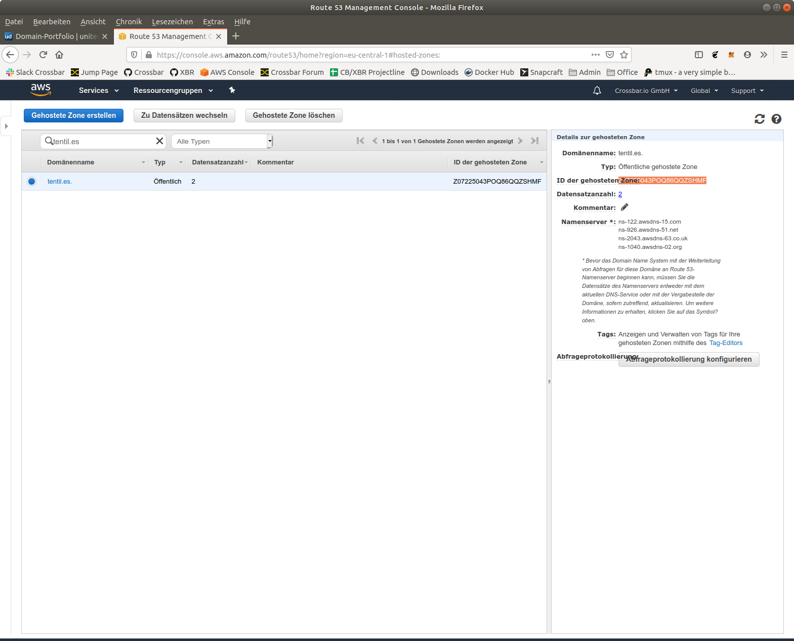

Open the zone and click on the NS record that was created automatically:

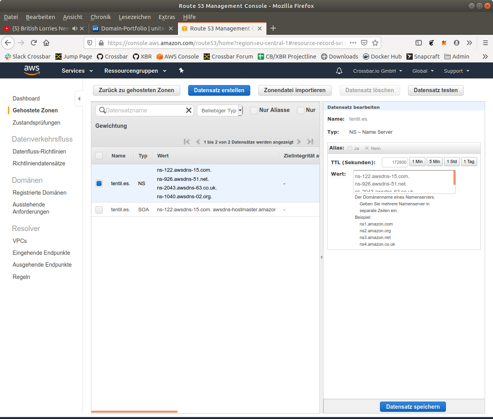

This record refers to the DNS nameservers that must be used for this zone.

## Configure your DNS domain

Next, at your DNS registrar, configure the AWS nameservers of your zone

```
ns-122.awsdns-15.com
ns-926.awsdns-51.net
ns-2043.awsdns-63.co.uk
ns-1040.awsdns-02.org
```

that apply for your domain.

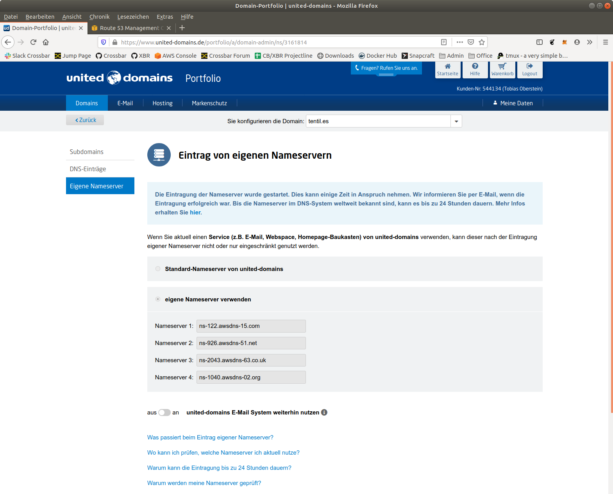

After configuration, the new nameservers need to propagate the DNS system.

Once that has happened (which may take several minutes to half an hour), resolving
your domain should look like:

```console
```


* [http://idma2020.de/](http://idma2020.de/)
* [https://idma2020.de/](https://idma2020.de/)


## Packer

The Terraform based setup on AWS is based on AMIs which come with Docker and Crossbar.io FX preinstalled.

We use [HashiCorp Packer](https://www.packer.io/) to bake AMI images directly from our Crossbar.io FX Docker images.

To rebuild and publish AMI images after a new Crossbar.io FX Docker image has been published, run:

```console
make build
```

Note the AMI ID printed, and update [root/variables.tf](root/variables.tf) accordingly, eg

* CrossbarFX 20.6.2: **ami-06ca2353bcdf3ac29**

Here is the log for above:

```console
oberstet@intel-nuci7:~/scm/crossbario/crossbario-devops/terraform$ make build
...
==> amazon-ebs: Digest: sha256:32b6329873e0a755121e18f7757874de24d4a557108cf4d1b36903a7cae669ad
==> amazon-ebs: Status: Downloaded newer image for crossbario/crossbarfx:pypy-slim-amd64
    amazon-ebs:
    amazon-ebs:     :::::::::::::::::
    amazon-ebs:           :::::          _____                 __              _____  __
    amazon-ebs:     :::::   :   :::::   / ___/______  ___ ___ / /  ___ _____  / __/ |/_/
    amazon-ebs:     :::::::   :::::::  / /__/ __/ _ \(_-<(_-</ _ \/ _ `/ __/ / _/_>  <
    amazon-ebs:     :::::   :   :::::  \___/_/  \___/___/___/_.__/\_,_/_/   /_/ /_/|_|
    amazon-ebs:           :::::
    amazon-ebs:     :::::::::::::::::   Crossbar.io FX v20.6.2 [00000]
    amazon-ebs:
    amazon-ebs:     Copyright (c) 2013-2020 Crossbar.io Technologies GmbH. All rights reserved.
    amazon-ebs:
    amazon-ebs:  Crossbar.io        : 20.6.2
    amazon-ebs:    txaio            : 20.4.1
    amazon-ebs:    Autobahn         : 20.6.2
    amazon-ebs:      UTF8 Validator : autobahn
    amazon-ebs:      XOR Masker     : autobahn
    amazon-ebs:      JSON Codec     : stdlib
    amazon-ebs:      MsgPack Codec  : umsgpack-2.6.0
    amazon-ebs:      CBOR Codec     : cbor-1.0.0
    amazon-ebs:      UBJSON Codec   : ubjson-0.16.1
    amazon-ebs:      FlatBuffers    : flatbuffers-1.12
    amazon-ebs:    Twisted          : 20.3.0-EPollReactor
    amazon-ebs:    LMDB             : 0.98/lmdb-0.9.22
    amazon-ebs:    Python           : 3.6.9/PyPy-7.3.0
    amazon-ebs:  CrossbarFX         : 20.6.2
    amazon-ebs:    NumPy            : 1.15.4
    amazon-ebs:    zLMDB            : 20.4.1
    amazon-ebs:  Frozen executable  : no
    amazon-ebs:  Operating system   : Linux-5.3.0-1023-aws-x86_64-with-debian-9.11
    amazon-ebs:  Host machine       : x86_64
    amazon-ebs:  Release key        : RWQHer9KKmNsqP057xopw37DfYE8pl92aOWU5E+OWdhlwtCns7nlKjpE
    amazon-ebs:
==> amazon-ebs: Stopping the source instance...
    amazon-ebs: Stopping instance
==> amazon-ebs: Waiting for the instance to stop...
==> amazon-ebs: Creating AMI crossbarfx-ami-1593617540 from instance i-05911e29903bfff0a
    amazon-ebs: AMI: ami-06ca2353bcdf3ac29
==> amazon-ebs: Waiting for AMI to become ready...
==> amazon-ebs: Terminating the source AWS instance...
==> amazon-ebs: Cleaning up any extra volumes...
==> amazon-ebs: No volumes to clean up, skipping
==> amazon-ebs: Deleting temporary security group...
==> amazon-ebs: Deleting temporary keypair...
Build 'amazon-ebs' finished.

==> Builds finished. The artifacts of successful builds are:
--> amazon-ebs: AMIs were created:
eu-central-1: ami-06ca2353bcdf3ac29

(cpy382_1) oberstet@intel-nuci7:~/scm/crossbario/crossbario-devops/terraform$
```


## Screenshots

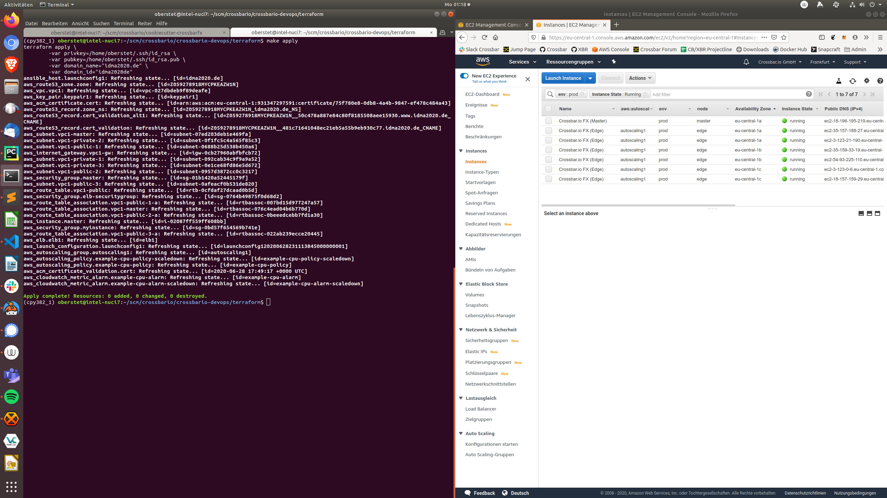
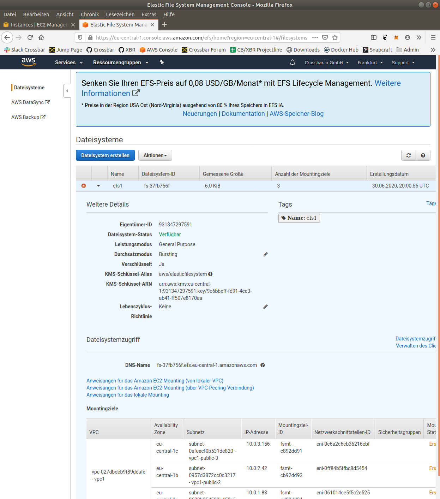
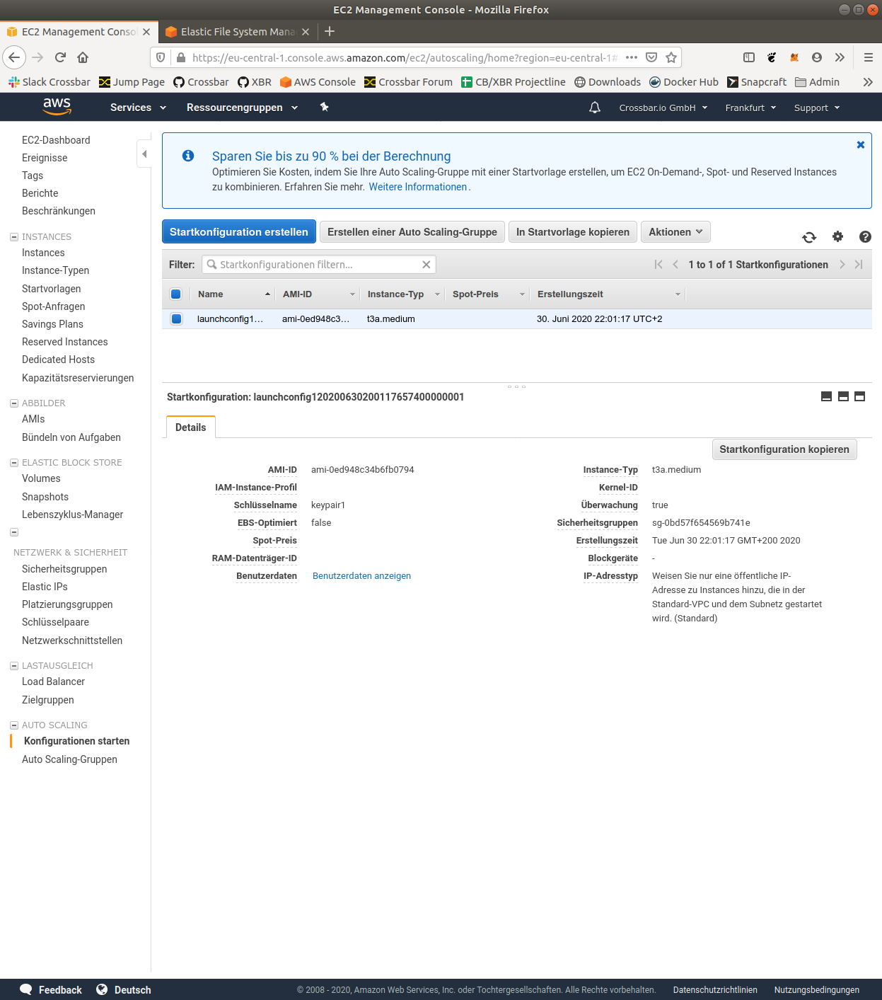
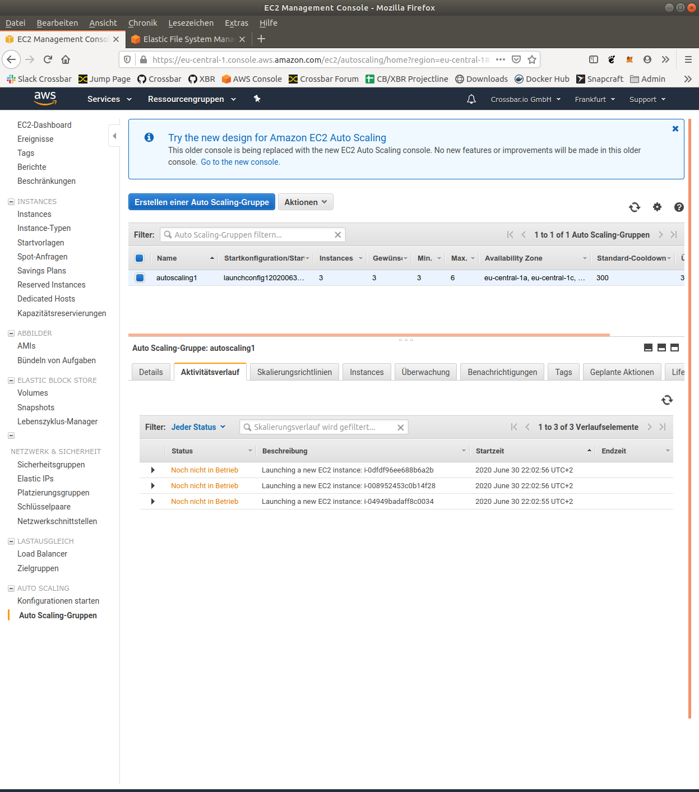
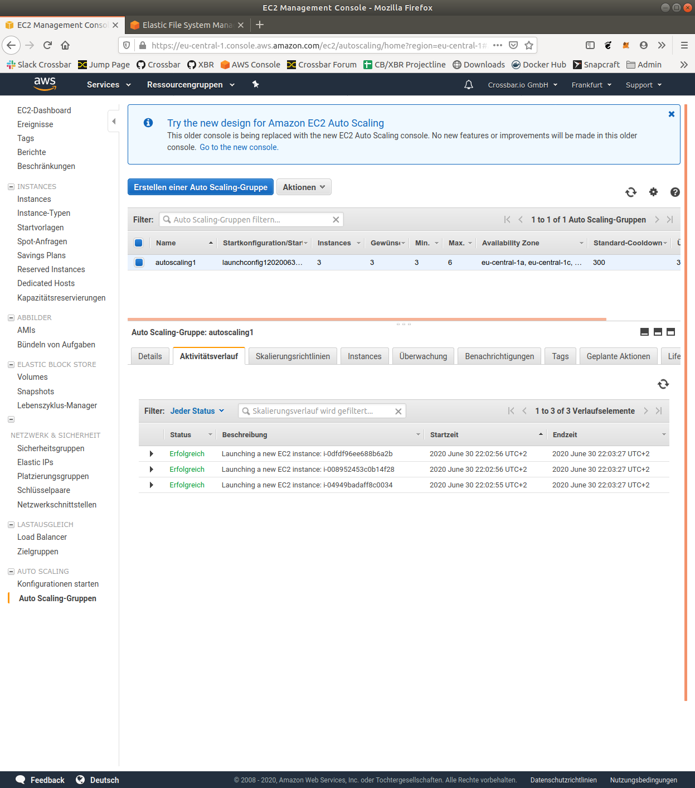
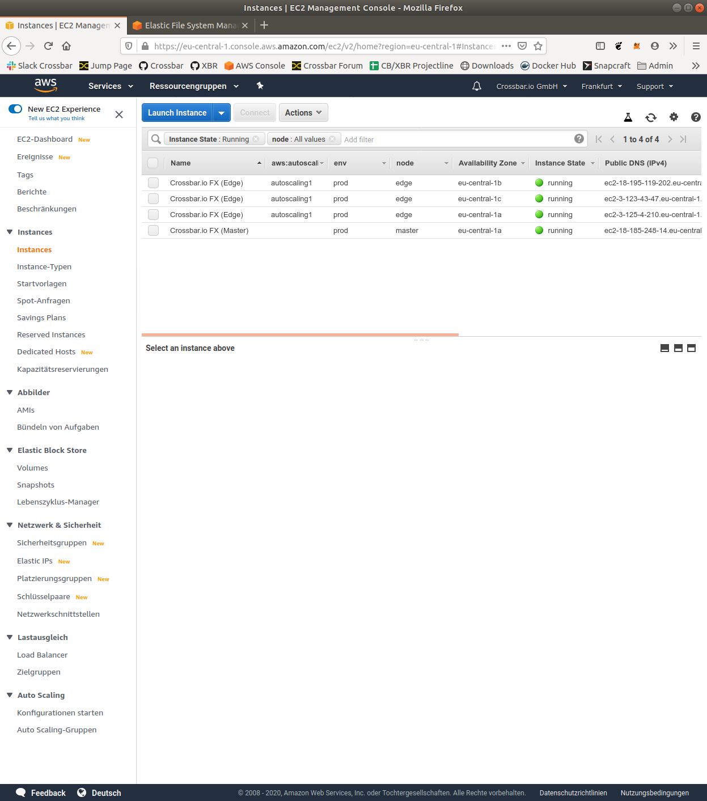
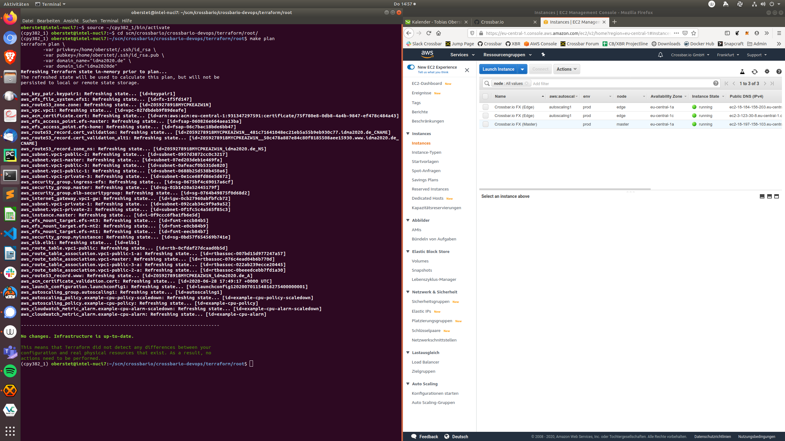
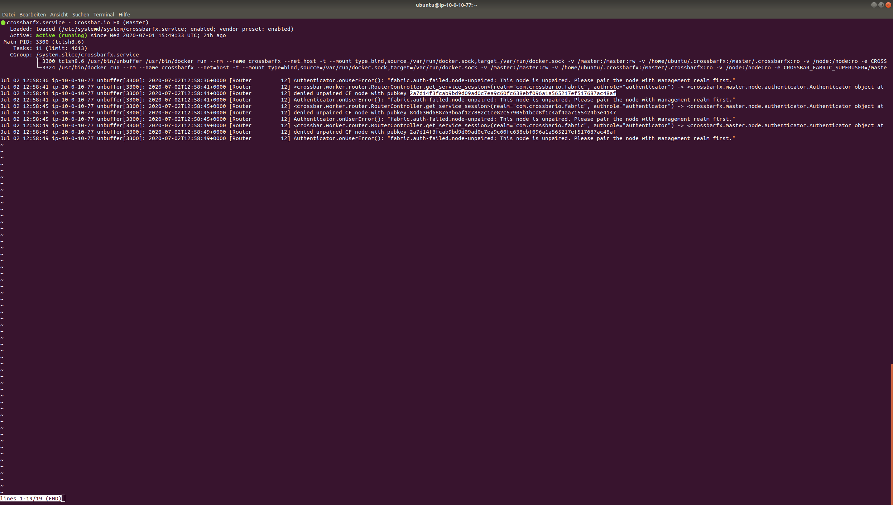
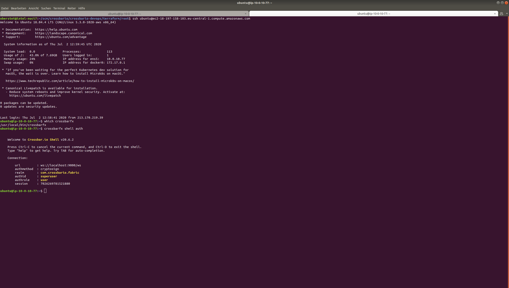
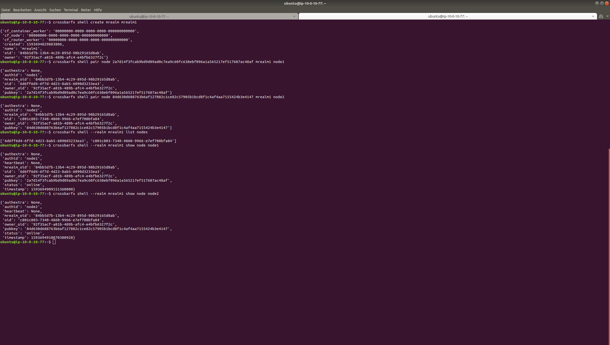


## References

* https://earlruby.org/2019/01/creating-aws-efs-elastic-filesystems-with-terraform/
* https://github.com/manicminer/ansible-auto-scaling-tutorial
* https://registry.terraform.io/modules/devops-workflow/efs/aws/0.6.2
* https://www.terraform.io/docs/providers/aws/r/efs_file_system.html
* https://cwong47.gitlab.io/technology-terraform-aws-efs/
* https://docs.ansible.com/ansible/latest/user_guide/intro_dynamic_inventory.html#inventory-script-example-aws-ec2
* https://docs.ansible.com/ansible/latest/scenario_guides/guide_aws.html
* https://docs.ansible.com/ansible/latest/user_guide/playbooks.html
* https://www.grailbox.com/2020/04/how-to-set-up-a-domain-in-amazon-route-53-with-terraform/
* https://www.azavea.com/blog/2018/07/16/provisioning-acm-certificates-on-aws-with-terraform/
