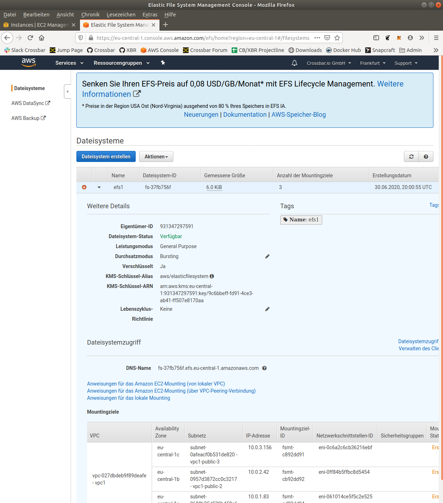

## 1 - Start master node


## 2 - Start edge node


## 3 - Restart edge node


## Complete auto-configuration using Terraform


## Screenshots





## Publish

List tags of current releases:

```console
git tag -l
```

Use an incremented tag for new release:

```console
git add . && git commit -m "updates" && git push && \
git tag -a v1.1.3 -m "tagged release" && git push --tags
```

## References

* https://earlruby.org/2019/01/creating-aws-efs-elastic-filesystems-with-terraform/
* https://github.com/manicminer/ansible-auto-scaling-tutorial
* https://registry.terraform.io/modules/devops-workflow/efs/aws/0.6.2
* https://www.terraform.io/docs/providers/aws/r/efs_file_system.html
* https://cwong47.gitlab.io/technology-terraform-aws-efs/
* https://docs.ansible.com/ansible/latest/user_guide/intro_dynamic_inventory.html#inventory-script-example-aws-ec2
* https://docs.ansible.com/ansible/latest/scenario_guides/guide_aws.html
* https://docs.ansible.com/ansible/latest/user_guide/playbooks.html
* https://www.grailbox.com/2020/04/how-to-set-up-a-domain-in-amazon-route-53-with-terraform/
* https://www.azavea.com/blog/2018/07/16/provisioning-acm-certificates-on-aws-with-terraform/
