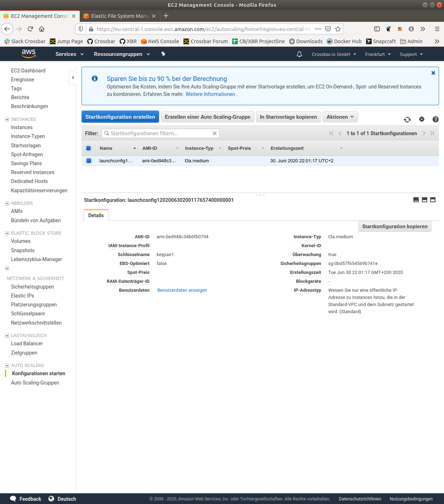
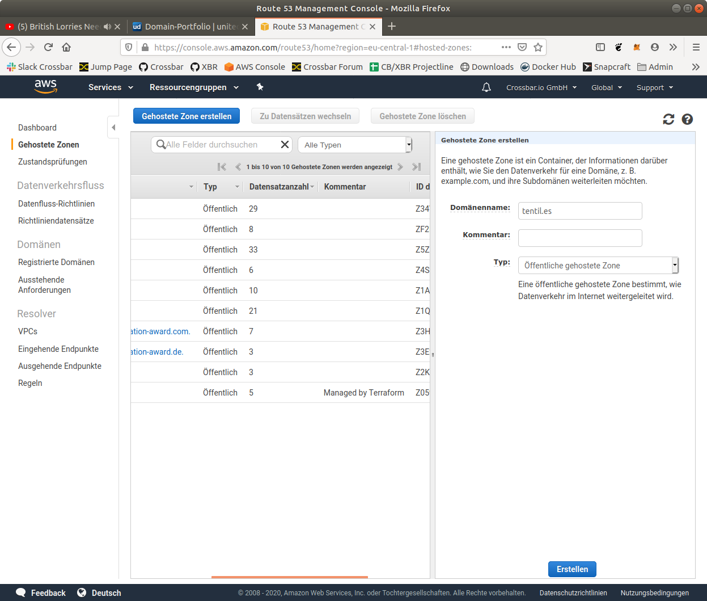

## Tutorials

```console
$ cat ~/.crossbarfx/config.ini
[default]
url=ws://localhost:9000/ws
privkey=default.priv
pubkey=default.pub
terminal 1:
$ make clean
$ make run_master
terminal 2:
$ make run_node1
.. wait a couple of secs before restarting the node ..
$ make run_node1
terminal 3:
$ make run_node2
.. wait a couple of secs before restarting the node ..
$ make run_node2
terminal 4:
make show_master
make status_nodes
crossbarfx shell monitor
```


```console
crossbarfx shell --realm default list webclusters
crossbarfx shell --realm default create webcluster cluster1 --config='{}'
crossbarfx shell --realm default show webcluster cluster1

crossbarfx shell --realm default show node node-a3683925
crossbarfx shell --realm default show node node-9542bfdd

crossbarfx shell --realm default list webcluster-nodes cluster1

crossbarfx shell --realm default add webcluster-node cluster1 node-a3683925 --config '{"webcluster_oid": "95f30cf5-444f-4c40-8d02-be58c89d5a66"}'
crossbarfx shell --realm default add webcluster-node cluster1 node-9542bfdd --config '{"webcluster_oid": "95f30cf5-444f-4c40-8d02-be58c89d5a66", "parallel": 8}'

crossbarfx shell --realm default list webcluster-nodes cluster1
crossbarfx shell --realm default show webcluster-node cluster1 node-9542bfdd

crossbarfx shell --realm default start webcluster cluster1
```

### Crossbar Cloud Terraform Tutorial

1. Domain registration
   * http://www.showroomdummy.com/
   * https://www.united-domains.de/portfolio/
1. AWS zone creation
   * https://console.aws.amazon.com/route53/home
1. DNS configuration
   * https://www.united-domains.de/portfolio/
1. Terraform
   * create and adjust main.tf
   * run terraform apply
1. Test
   * mydomain.xyz
   * shell
   * WAMP clients **-> Autobahn Cookiecutter Tutorial**

### Autobahn Cookiecutter Tutorial

Write me.

## 1 - Start master node


## 2 - Start edge node


## 3 - Restart edge node


## Complete auto-configuration using Terraform


## Screenshots








## Publish

List tags of current releases:

```console
git tag -l
```

Use an incremented tag for new release:

```console
git add . && git commit -m "updates" && git push && \
git tag -a v1.1.3 -m "tagged release" && git push --tags
```

## References

* https://earlruby.org/2019/01/creating-aws-efs-elastic-filesystems-with-terraform/
* https://github.com/manicminer/ansible-auto-scaling-tutorial
* https://registry.terraform.io/modules/devops-workflow/efs/aws/0.6.2
* https://www.terraform.io/docs/providers/aws/r/efs_file_system.html
* https://cwong47.gitlab.io/technology-terraform-aws-efs/
* https://docs.ansible.com/ansible/latest/user_guide/intro_dynamic_inventory.html#inventory-script-example-aws-ec2
* https://docs.ansible.com/ansible/latest/scenario_guides/guide_aws.html
* https://docs.ansible.com/ansible/latest/user_guide/playbooks.html
* https://www.grailbox.com/2020/04/how-to-set-up-a-domain-in-amazon-route-53-with-terraform/
* https://www.azavea.com/blog/2018/07/16/provisioning-acm-certificates-on-aws-with-terraform/
